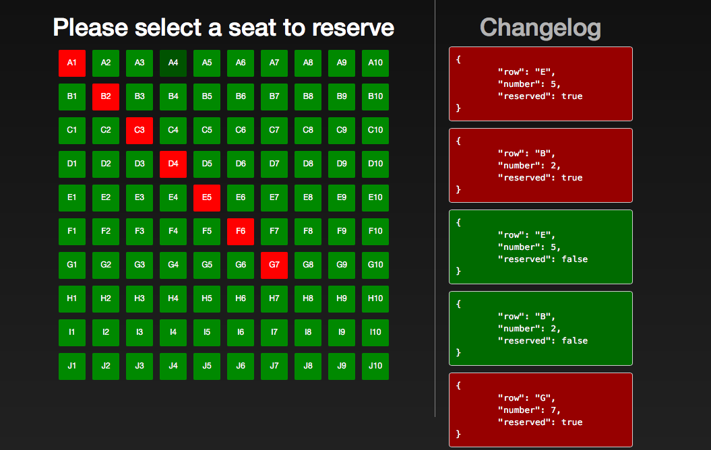

# ATEC Reservations using WebSockets

## Running this code sample

First, you will need to [install Meteor](https://meteor.com/install)

Then simply clone this repo and run `meteor` at the terminal

Meteor will inform you of where you can reach the running instance

It should look something like this

## Inspecting the code

Most of the interesting bits are in [imports/ui/body.js](imports/ui/body.js)
